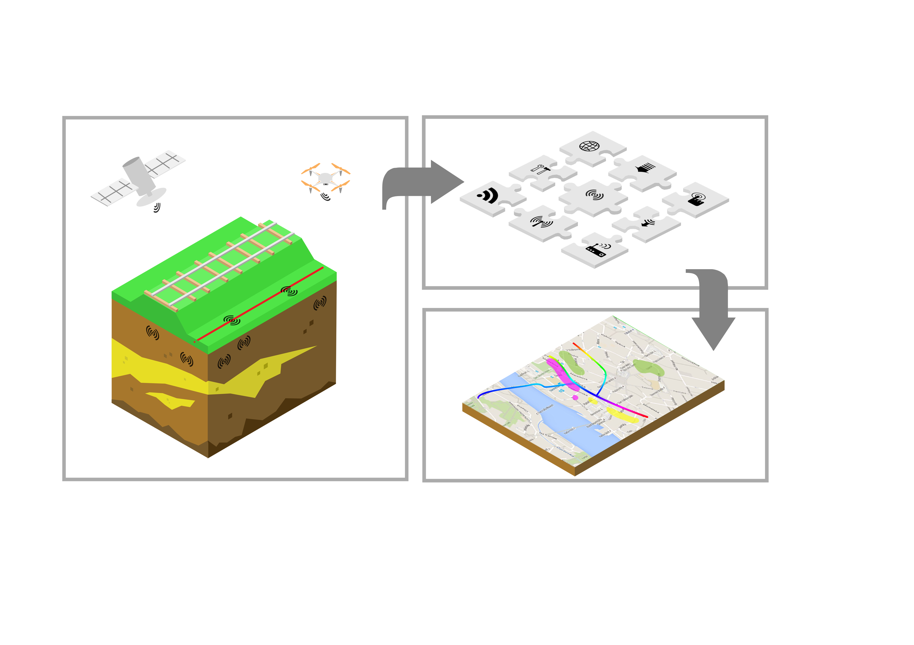

# README #

ROSE consists of a software for the computation of railway track degradation.

The ROSE software simulates train-track interaction, and computes the resulting
long-term deformation caused by train traffic.

The ROSE software allows the use of data in order to improve the schematisation
and parameterisation of the model.

## Developers
The ROSE software has been developed within a TKI project, and in a consortium with the following partners:

* [Deltares](https://www.deltares.nl)

* [ProRail](https://www.prorail.nl)

* [Sensar](https://www.sensar.nl)

* [Fugro](https://www.fugro.com/nl)

* [Ricardo Rail](https://www.ricardo.com/rail/)
