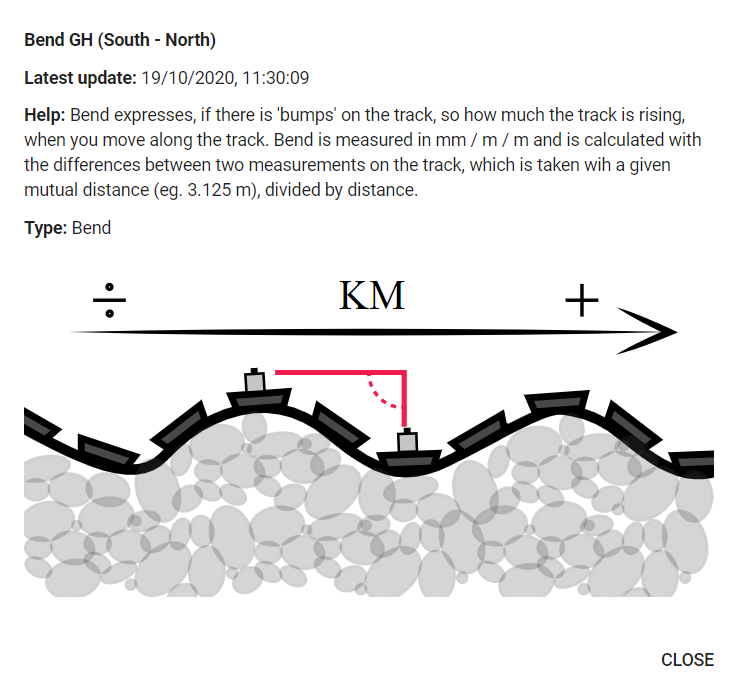
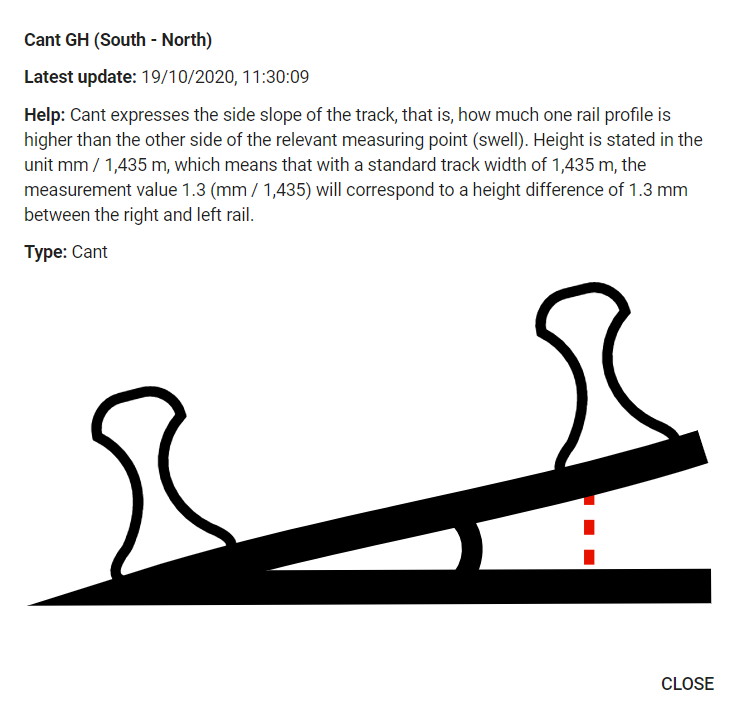
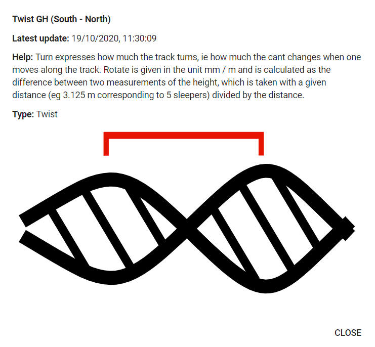
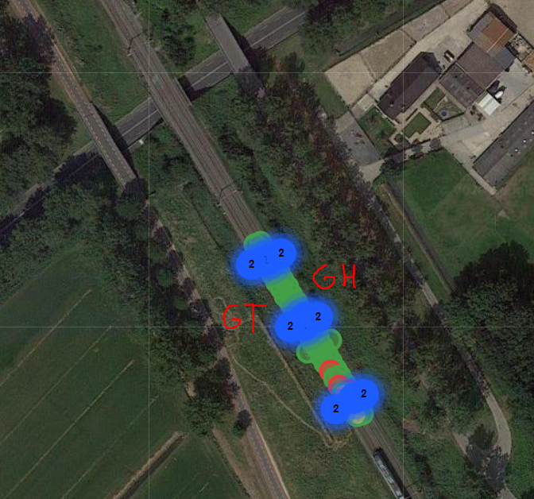

# Information about ProRail data

Received from [Joost](mailto:Joost.vantSchip@prorail.nl).

hierbij de Culemborg data verzameld met de RailMonitor tilt- , vocht- en regensensoren.
Dit is de ruwe data: elk mapje bevat een dag aan data, met als namen timestamps waarop ik het laatste half uur aan data heb opgevraagd.
Als je de data aan elkaar plakt (en duplicaten eruit haalt) zou dat een beeld moeten geven hoe de sensoren het het afgelopen jaar hebben gedaan.

## measurements
Data containing moisture content and precipitation.

## traces
Data containing cant, bent, twist, settlement and tilt.

The following figures explain how the measurements are computed:

## Track names

