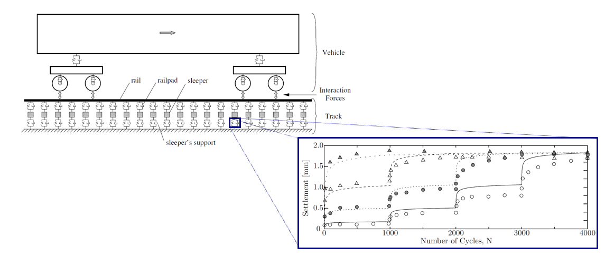

ROSE
====

ROSE is an open-source calculation model to compute the railway track degradation.
ROSE is a numerical model based on the finite element method, mainly on the beam theory and Winkler foundation.
ROSE is build in `Python <https://www.python.org/>`_.

ROSE consists of:

* train-track interaction model that computes the dynamic response
* cyclic cumulative models that compute the track degradation in time.

   Scope of the ROSE model.

ROSE Installation
=================

Installing ROSE as a user
-------------------------
It is recommended to install ROSE in a Python virtual environment.
The main purpose of Python virtual environments is to create an isolated environment for Python projects.
This means that each project can have its own dependencies, regardless of what dependencies every other project has.
This avoids issues with packages dependencies.

The virtual environment should be installed and activated before the installation of ROSE.
To create a virtual environment with pip follow this `link <https://docs.python.org/3/library/venv.html>`_.
To create a virtual environment with conda follow this `link <https://conda.io/projects/conda/en/latest/user-guide/tasks/manage-environments.html#creating-an-environment-with-commands>`_.

Currently, ROSE supports Python 3.9, 3.10 and 3.11, therefore, you need to create the virtual environment with one of these Python versions.

Installing ROSE as a user

To install ROSE stable release, run the following code in your environment:

.. code-block::

   pip install git+https://github.com/PlatypusBytes/ROSE.git

Installing ROSE as a developer
------------------------------
To install the package as a developer, you need first to check out the repository.

.. code-block::

   git clone https://github.com/PlatypusBytes/ROSE.git

To install the package in editable mode with the following command:

.. code-block::

   pip install -e ."[testing]"

This will install the package in editable mode, so that any changes you make to the code will be reflected in the installed package.
The [testing] flag will also install the dependencies needed for running the tests.

Alternatively, you can install the requirements manually with the following command:

.. code-block::

   pip install -r requirements.txt

Tutorials
=========
In ROSE several tutorials are available in the form of Jupyter notebooks.
The tutorials are available in the following links:

* Tutorial 1 - `How to setup and run the ROSE model ROSE model <../../tutorials/rose_demo.ipynb>`_
* Tutorial 2 - `How to compute the rail strain with the ROSE model <../../tutorials/calculate_strain.ipynb>`_
* Tutorial 3 - `How to perform the model optimisation in the ROSE model <../../tutorials/rose_optimisation.ipynb>`_.

ROSE team
=========
ROSE is a research programme that results from a collaboration between the following partners:

* `ProRail <https://www.prorail.nl>`_
* `Deltares <https://www.deltares.nl>`_
* `Fugro <https://www.fugro.com/>`_
* `Sensar <https://sensar.nl/>`_
* `Ricardo Rail <https://www.ricardo.com/rail/>`_.

The :doc:`authors`.

Package documentation
=====================
The :doc:`rose` documentation.
