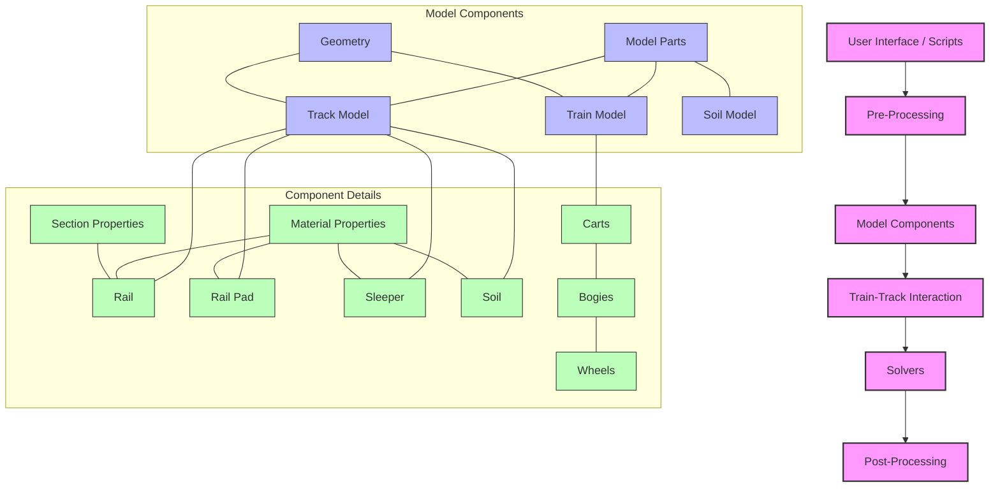

# ROSE Software Architecture

## Description

The ROSE software architecture consists of several key components:

1. **Pre-Processing**:
   - Handles input data preparation
   - Geometry creation and mesh generation
   - Material property definition
   - Train configurations

2. **Model Components**:
   - **Track Model**: Rail, rail pad, sleeper, and soil elements
   - **Train Model**: Carts, bogies, and wheels
   - **Soil Model**: Soil layers with different properties

3. **Train-Track Interaction**:
   - Manages the coupling between train and track
   - Handles contact mechanics (Hertzian contact)
   - Applies train loading to track

4. **Solvers**:
   - Numerical methods for time integration
   - Includes Newmark, HHT, and other solvers
   - Handles dynamic analysis

5. **Post-Processing**:
   - Result collection and storage
   - Visualization tools
   - Settlement calculations
   - Long-term performance analysis

This architecture enables simulation of train-track dynamic interaction and prediction of long-term track degradation through sequential application of each component.