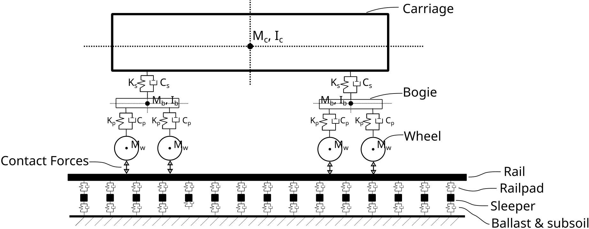

# Summary

Railway infrastructure management requires accurate prediction of rail track degradation to optimize maintenance operations and ensure safe railway operations. ROSE is an open-source Python package designed to simulate train-track dynamic interaction and compute the resulting long-term deformation caused by train traffic. The software implements several established models for cumulative settlement, and provides an interface to plug-in custom cumulative settlement models, enabling engineers and researchers to analyze railway track behavior under varying operational and environmental conditions.

# Statement of need

Railway tracks are essential elements of transportation infrastructure, which require significant financial investment in both construction and maintenance.
In Europe, construction costs range from €13 million to €40 million per kilometer `[Lopez:2008]`, while 40–50% of maintenance expenses go toward track geometry maintenance `[Zhai:2004, schmitt:2006]`. With demand for railway transportation rising - in Europe it is expected to account for 50% of freight transport by 2050 - ensuring track reliability through effective maintenance is crucial.

Models that simulate dynamic train-track interaction by means of a multi-body dynamic model and models that estimate the cumulative deformation that results for the train traffic exist in literature. However, these models are not open-source, limiting their accessibility, transparency, and usability for researchers and practitioners.

<!-- To address this gap, ROSE, a Python package, provides a free and open-source solution for computing railway track degradation. It allows users to analyze dynamic train-track interactions using customizable train models and integrates both literature-based and user-defined degradation models. ROSE enables infrastructure managers to estimate track degradation based on different train scenarios and assess the impact of track elements such as transition zones and rail joints. By making advanced modeling accessible, ROSE supports data-driven maintenance planning and helps improve railway infrastructure sustainability. -->

ROSE addresses this gap by providing a free, open‑source, and modular framework that:
* Simulates the dynamic response of rails, sleepers, pads, ballast/soil, and vehicle bodies to train passage;
* Computes cumulative deformation using established settlement/accumulation models from the literature;
* Provides an interface for user to implement, compare, and validate new degradation models without re‑implementing the vehicle-track dynamics;
* Integrates field measurements for calibration and validation; and
* Supports stochastic studies to capture variability and quantify risk.

<!-- This combination lowers the barrier for reproducible research, enables cross‑comparison of models under a common workflow, and helps infrastructure managers evaluate maintenance scenarios quantitatively. -->
ROSE enables infrastructure managers to estimate track degradation based on different train scenarios and assess the impact of track elements such as transition zones and rail joints. By making advanced modeling accessible, ROSE supports data-driven maintenance planning and helps improve railway infrastructure sustainability.

# Software Description

ROSE is built with a modular architecture that separates the definitions of the train, track, and degradation models from the numerical solvers \autoref{fig:train_model}.

## Train and track model

The track is modeled using Timoshenko beam elements to represent the rails, which are supported by discrete spring-damper elements representing rail pads, sleepers, and ballast/soil layers.
The train is modeled as a multi-body system with primary and secondary suspensions, enabling detailed analysis of wheelset dynamics and wheel-rail contact forces for various train configurations and speeds.

The interaction between the train and track is captured through contact forces at the wheel-rail interface, which are computed based on the relative displacements and velocities of the wheels and rails, following a Hertzian contact model. Irregularities in the track geometry can be included to simulate real-world conditions, as well as the presence of rail joints and wheel flats.

ROSE contains a library of trains, but it offers the possibility for the users to define their own train configuration model. This is done by specifying the parameters of the multi-body system, such as carbody geometry, suspension stiffness, damping coefficients, and carbody mass.

The track model is highly configurable, allowing users to define various track sections with different stiffness of the ballast/soil layers, allowing users to simulate heterogeneous track conditions (e.g. with the use of random fields), or transition zones where track properties change abruptly.

## Settlement Models

ROSE includes several established settlement models, such as those by Li and Selig [@Li_Selig:1996] as modified by Charoenwong et al. [@Charoenwong:2022], Varandas et al. [@varandas:2014], Nasrollahi et al. [@Nasrollahi:2023], Sato [@Sato:1997], and Shenton [@Shenton_1985]. ROSE's key strength is modularity; users can easily implement and test novel settlement models without needing to develop a train-track interaction model from scratch.

# Getting ROSE

ROSE is licensed under the MIT License and is available for installation from the Python Package Index (PyPI) via `pip install rose-degradation`. The source code is hosted on [Github](https://github.com/PlatypusBytes/ROSE), where we encourage contributions of features and accumulation models.

Comprehensive [online documentation](https://rose-model.readthedocs.io/), including installation guides and tutorials, is available to guide users.

# Impact

ROSE was developed within a consortium of infrastructure managers, engineering consultancies, and research institutions. It has already been applied in practice to analyze track transition zones, predict maintenance needs for various traffic scenarios, and evaluate the effectiveness of soil improvement measures.

The open-source nature of the software fosters collaboration between industry and academia, providing a common platform for testing theoretical models against field data. It is a valuable tool for researchers investigating infrastructure performance, engineers responsible for maintenance planning, and academic institutions teaching railway engineering principles. By making advanced modeling more accessible, ROSE supports the development of more sustainable and cost-effective railway infrastructure.

# Acknowledgements

The development of ROSE has been supported by a Topconsortia voor Kennis en Innovatie (TKI) project and carried out in a consortium with Deltares, ProRail, Sensar, Fugro, and Ricardo Rail. We gratefully acknowledge their financial and technical contributions.

# References
